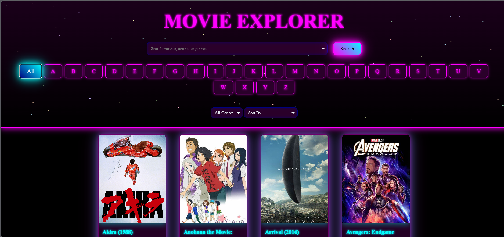
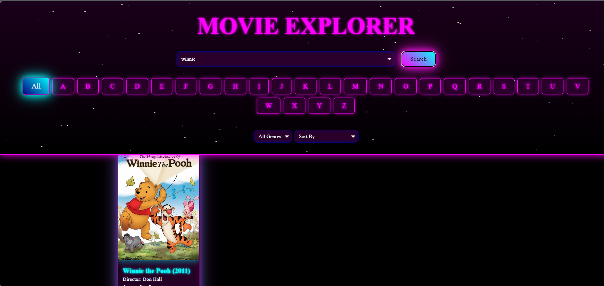
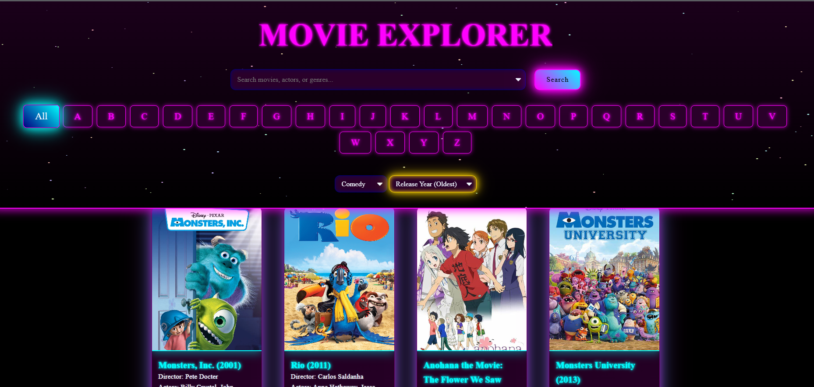
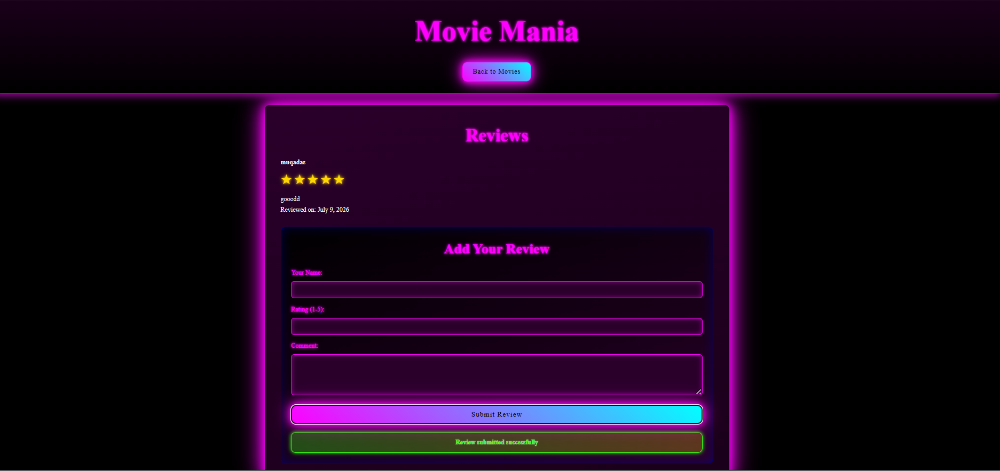

# 🎬 Movie Database Management System

A full-stack movie database web application that allows users to browse, search, filter, sort, and review movies. The application is powered by a MySQL relational database with an Express.js backend and a responsive HTML/CSS/JavaScript frontend.

---

## 📌 Project Overview

The Movie Database Management System provides an interactive platform for exploring movie information stored in a relational database. It demonstrates database design, REST API development, backend integration, and frontend implementation while showcasing SQL queries, views, and CRUD operations.

---

## ✨ Features

- 🔍 Search movies by title, actor, or genre
- 🎭 Filter movies by genre
- 🔤 Browse movies alphabetically
- ⭐ Sort by
  - Rating
  - Release Year
  - Box Office Revenue
  - Title (A-Z / Z-A)
- 📄 View detailed movie information
- 🎬 Watch embedded trailers
- 📝 Submit and view movie reviews
- 📱 Responsive user interface
- 🎨 Animated particle background

---

## 🛠️ Tech Stack

### Frontend

- HTML5
- CSS3
- JavaScript (ES6)

### Backend

- Node.js
- Express.js

### Database

- MySQL

### Tools

- MySQL Workbench
- DBeaver
- Git & GitHub
- VS Code

---

# 📸 Application Preview

## Home Page



---

## Search Movies



---

## Filters & Sorting



---

## Movie Details


---

## Reviews



---

## 🗂️ Project Structure

```text
Movie-database-management-system
│
├── public/
│   ├── index.html
│   ├── movie-details.html
│   ├── script.js
│   ├── movie-details-script.js
│   └── style.css
│
├── docs/
│   ├── screenshots/
│       ├── homepage.png
│       ├── search.png
│       ├── filter.png
│       ├── movie-detail.png
│       └── review.png
│   
│   
│
├── server.js
├── db.js
├── package.json
├── package-lock.json
├── movie.sql
├── README.md
└── .gitignore
```

---

# 🗄️ Database Design

The project uses a normalized relational database consisting of multiple tables including:

- Movies
- Actors
- Directors
- Genres
- MovieActors
- MovieGenres
- MovieReviews
- MovieSummaryView

The schema demonstrates:

- One-to-Many relationships
- Many-to-Many relationships
- SQL Views
- Joins
- Foreign Keys
- Aggregate Queries

---

# ⚙️ Installation

### Clone the repository

```bash
git clone https://github.com/muqadasilyas/Movie-database-management-system.git
```

### Navigate to the project

```bash
cd Movie-database-management-system
```

### Install dependencies

```bash
npm install
```

### Import the database

Import the provided **movie.sql** file into MySQL.

### Configure the database

Create a `.env` file:

```env
DB_HOST=localhost
DB_PORT=3306
DB_USER=your_username
DB_PASSWORD=your_password
DB_NAME=moviesystemdb
```

### Start the server

```bash
node server.js
```

Open

```
http://localhost:3001
```

---

# 📄 API Endpoints

| Method | Endpoint | Description |
|---------|----------|-------------|
| GET | `/api/movies` | Retrieve all movies |
| GET | `/api/movies/:id` | Retrieve movie details |
| GET | `/api/movies/:id/reviews` | Retrieve movie reviews |
| POST | `/api/reviews` | Submit a movie review |


---

# 🚀 Future Improvements

- User Authentication
- Admin Dashboard
- Favorites & Watchlist
- Recommendation System
- JWT Authentication
- Docker Deployment
- Cloud Database Hosting

---

# 👩‍💻 Author

**Muqadas Ilyas**

Software Engineering Student

GitHub: https://github.com/muqadasilyas

LinkedIn: https://linkedin.com/in/muqadas-ilyas-8681923b5

---

## ⭐ Support

If you found this project useful, consider giving it a **Star ⭐**.
